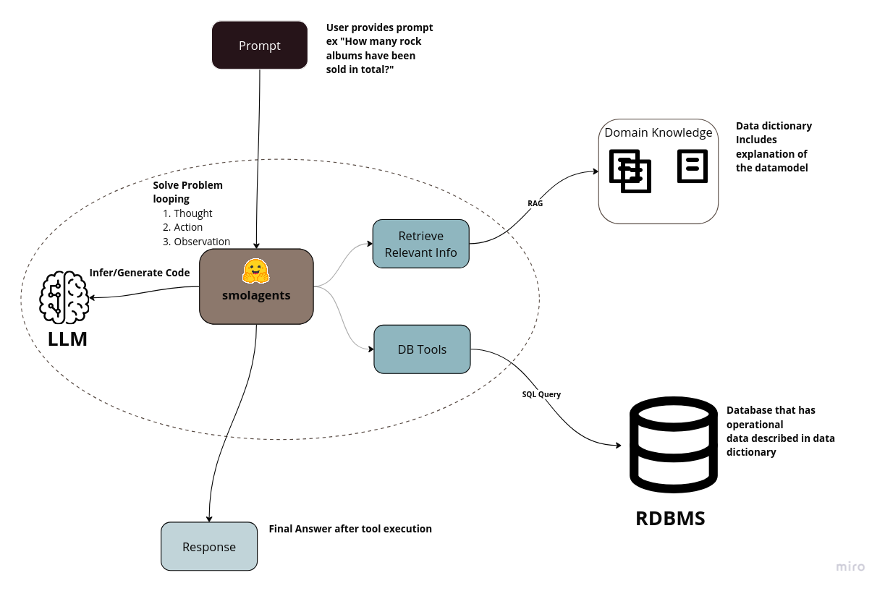

dddddddddddddddd# SQL Database Agent using SmolAgents

This repository contains the code to demonstrate how Hugging Face's SmolAgents can integrate with a Relational Database Management System (RDBMS). The goal is to create a generic database tool that executes SQL queries generated by a Large Language Model (LLM) using a simple Retrieval-Augmented Generation (RAG) approach. The final response is then summarized for clarity.

The `bot.py` script provides a Streamlit-based user interface that allows users to modify models, system prompts, and queries at runtime.

## Conceptual Overview



## Prerequisites
Ensure you have the following installed before proceeding:

1. **Anaconda** (for environment management) (Virtualenv is possible but anaconda makes life simple)
2. **SmolAgents** (`>= 1.3.0`)
3. **LiteLLM** (for managing LLM execution)
4. **OpenAI API Key** / **OLLAMA** / **Transformers** (for local model execution)
5. **Docker** (or access to an existing PostgreSQL server)

## Setup Instructions

### 1. Setup Environment
```sh
conda create -n smolagents
conda activate smolagents
pip install -r requirements.txt
docker compose -f sample-db-compose.yaml up -d
```

### 2. Configure Environment Variables
Create a `.env` file from the provided example:
```sh
cp .env_example .env
```
Edit the `.env` file to set the following values:
```ini
OPENAI_API_KEY=<YOUR_KEY>
OLLAMA_BASE_URL=http://localhost:11434
DOC_LOCATION=./docs
DB_HOST=localhost
DB_PORT=5432
DB_NAME=chinook
DB_USERNAME=postgres
DB_PASSWORD=postgres
```
*docs location* has markdown version of data dictionary which explains the table structure. I used ChatGPT to generate them by passing the SQL and then edited the documents.


### 3. Run the Streamlit Application
Start the Streamlit UI by running:
```sh
streamlit run bot.py
```
The application will be accessible in your browser at [http://localhost:8501/](http://localhost:8501/).

## Features
- Generates SQL queries dynamically using LLMs.
- Uses a simple RAG approach for context-aware query generation.
- Summarizes query results before presenting them.
- Provides a user-friendly Streamlit interface for runtime modifications.
- Supports multiple LLM backends (OpenAI, OLLAMA, Transformers, etc.).

## Future Enhancements
1. Extend support to additional models such as **Anthropic, Gemini, and Hugging Face API**.
2. Enhance the codebase by adding **additional tools and utilities**.
3. Improve **prompt engineering** for better query generation.
4. Upgrade from basic RAG to **Graph RAG** or integrate with **vector databases like Qdrant** for improved performance.


Feel free to fork it enhance it.

